# Beten Homes Rent - Smart Property Rental System

> A comprehensive property management platform for landlords and property managers to manage houses, rooms, tenants, rental agreements, payments, expenses, and receive automatic payment reminders.

## 📋 Overview

Beten Homes Rent is a full-stack property management solution with three components:

- **Desktop Application** - Full-featured property management (Electron + React + TypeScript)
- **Mobile Application** - Landlord reminder & monitoring app (React Native + Expo)
- **Backend API** - RESTful API server (Node.js + Express + TypeScript)

## 📸 Screenshots

### Desktop Application

|                                                       |                                           |
| ----------------------------------------------------- | ----------------------------------------- |
| **Login Page**                                        | **Dashboard**                             |
|            | 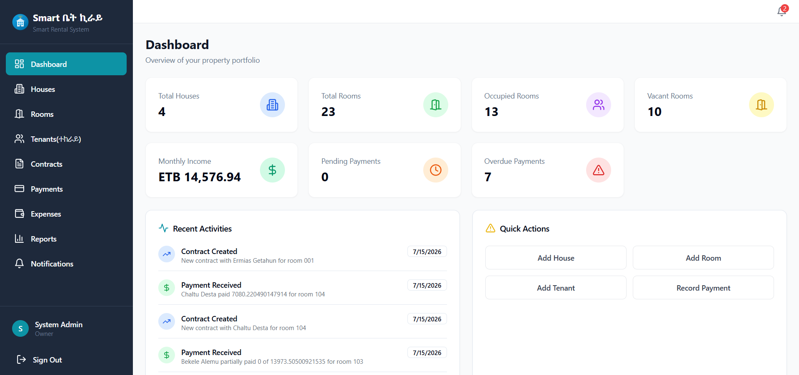   |
| **Houses**                                            | **Add House**                             |
| 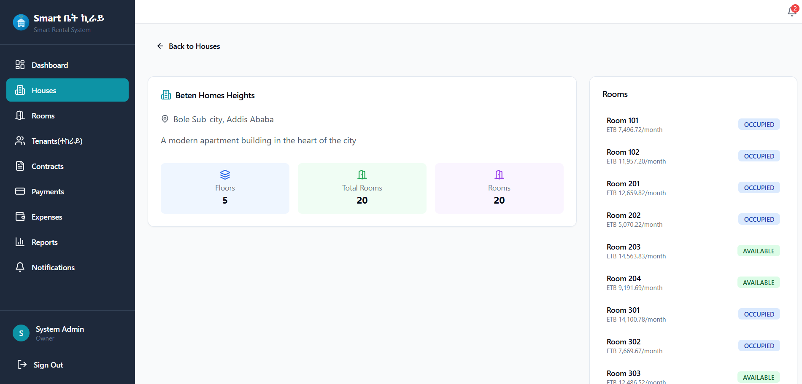                     |  |
| **Rooms**                                             | **Tenants**                               |
| 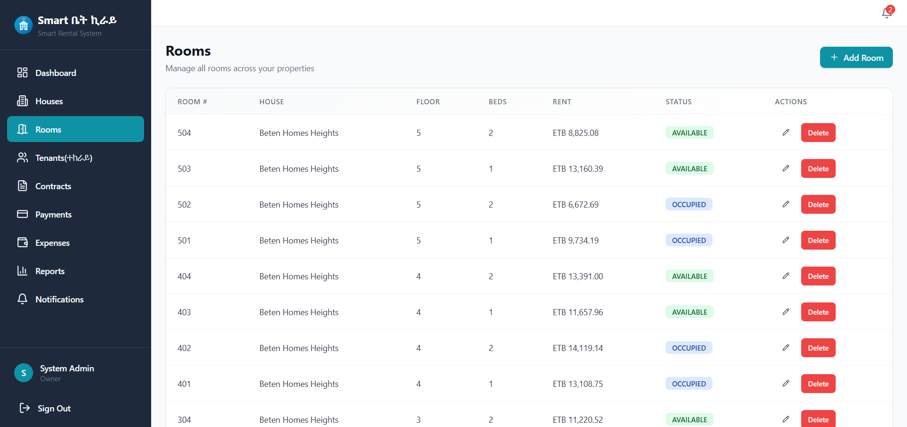                       | 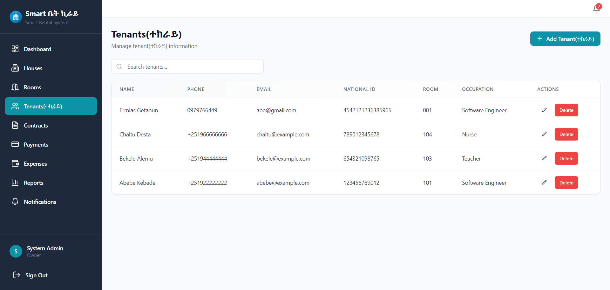       |
| **Contracts**                                         | **Payments**                              |
| 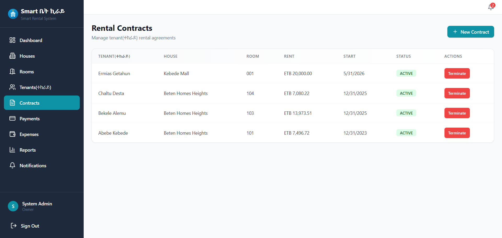               | 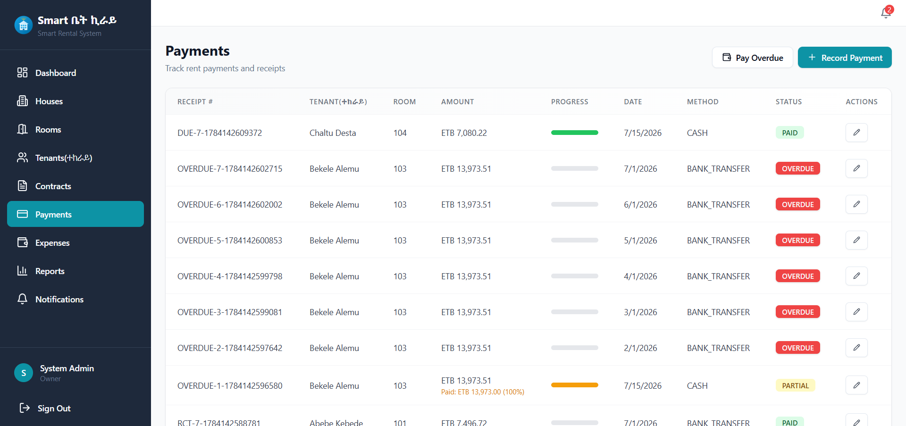     |
| **Record Expenses**                                   | **Reports**                               |
|  | 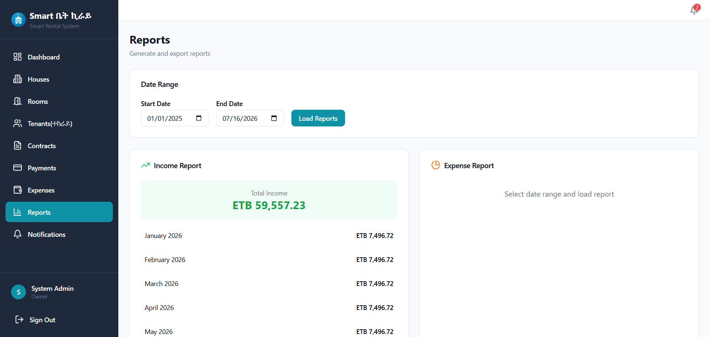       |
| **Notifications**                                     | **Profile**                               |
| 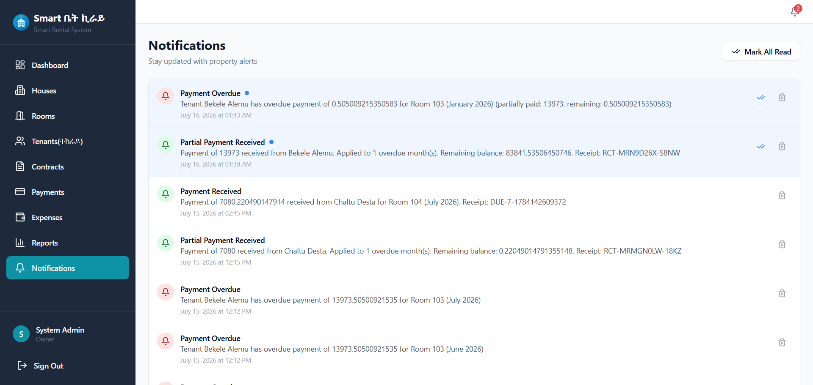       | 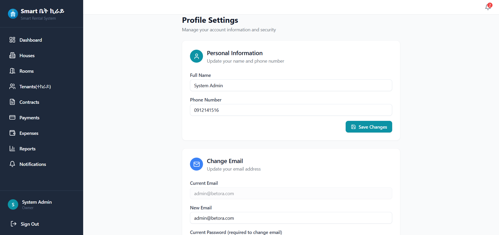       |

### Mobile Application

|                                                     |                                                              |
| --------------------------------------------------- | ------------------------------------------------------------ |
| **Login**                                           | **Dashboard**                                                |
| 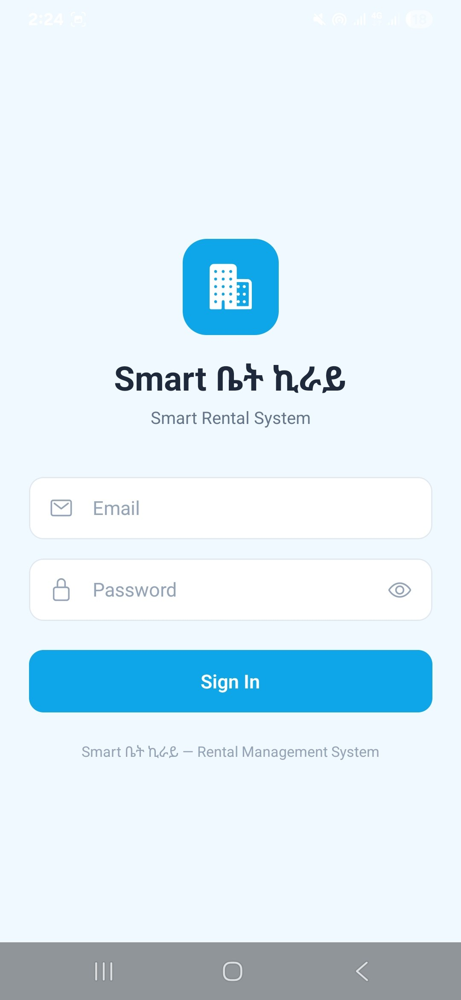       | 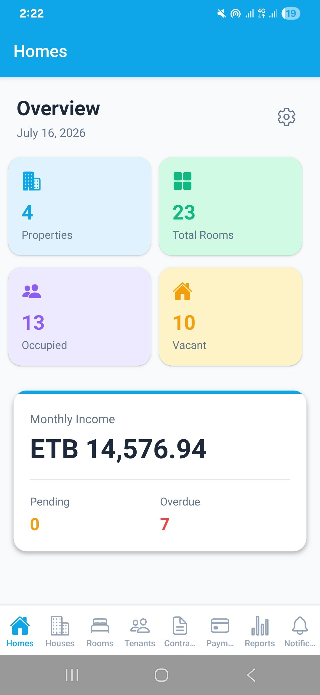            |
| **Houses**                                          | **Rooms**                                                    |
| 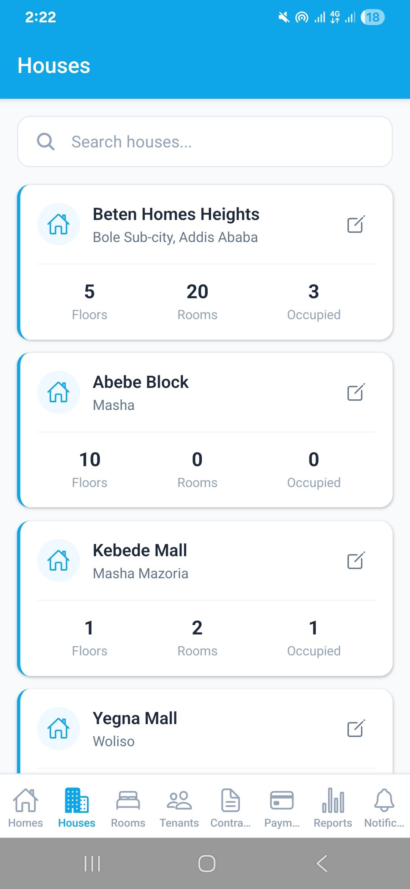     | 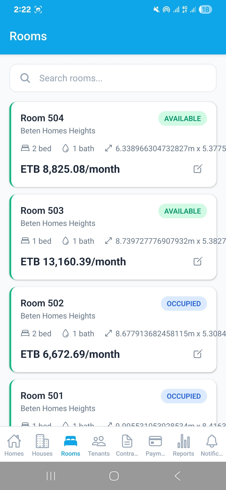                |
| **Tenants**                                         | **Contracts**                                                |
| 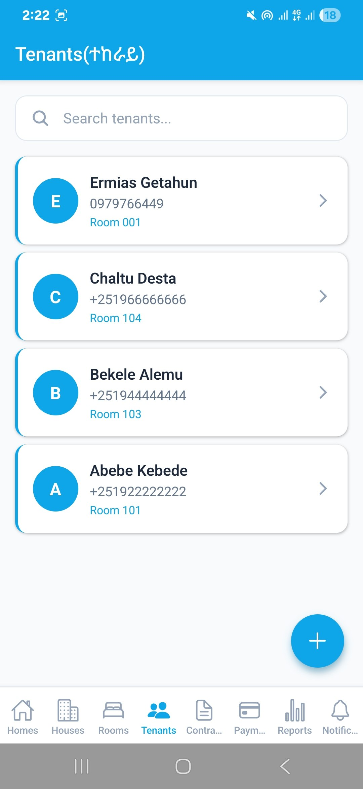   | 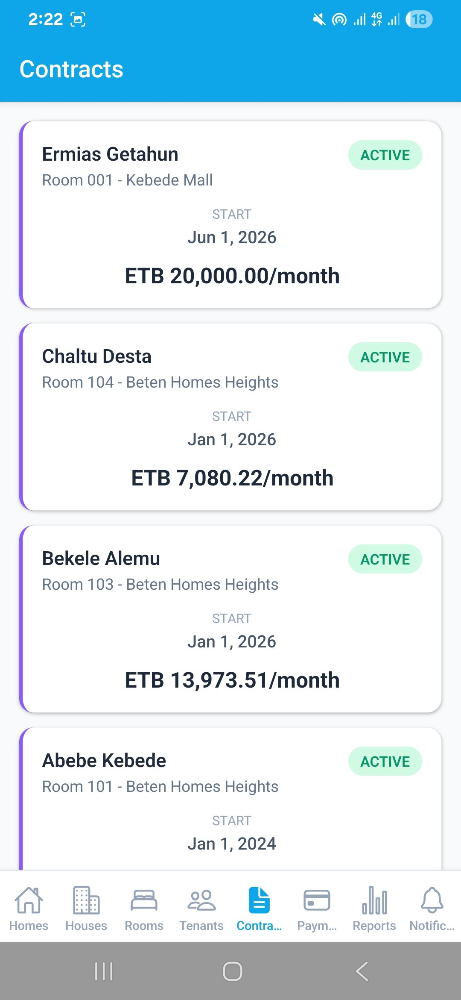        |
| **Payments**                                        | **Payment Details**                                          |
| 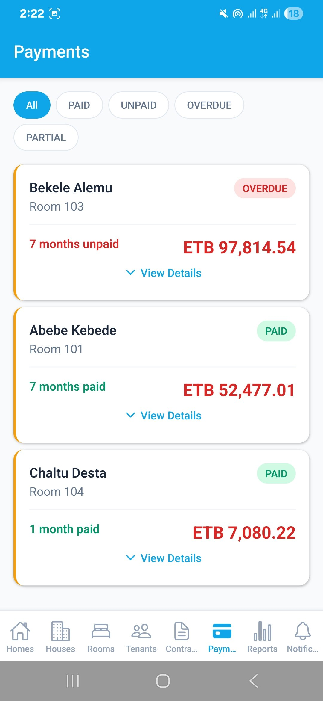 | 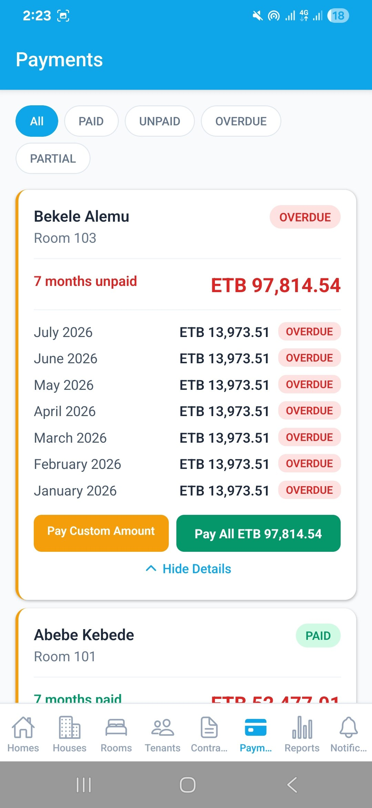  |
| **Reports**                                         | **Notifications**                                            |
| 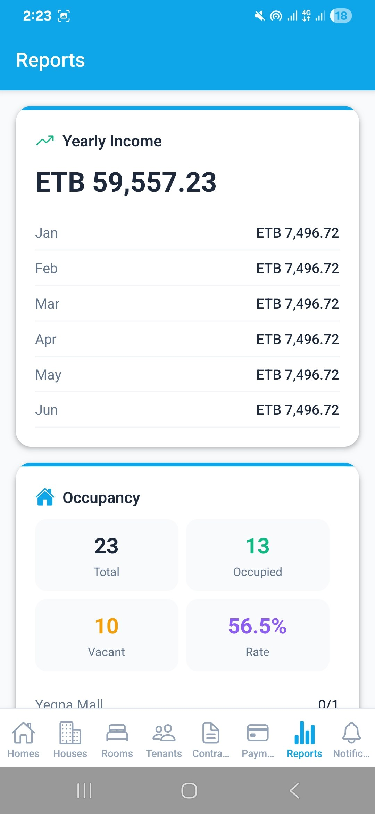    | 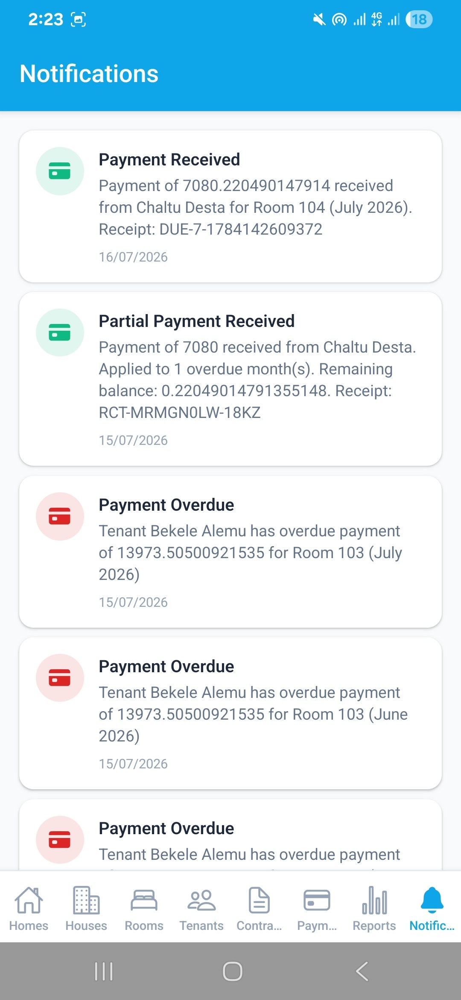 |
| **Profile**                                         |                                                              |
| 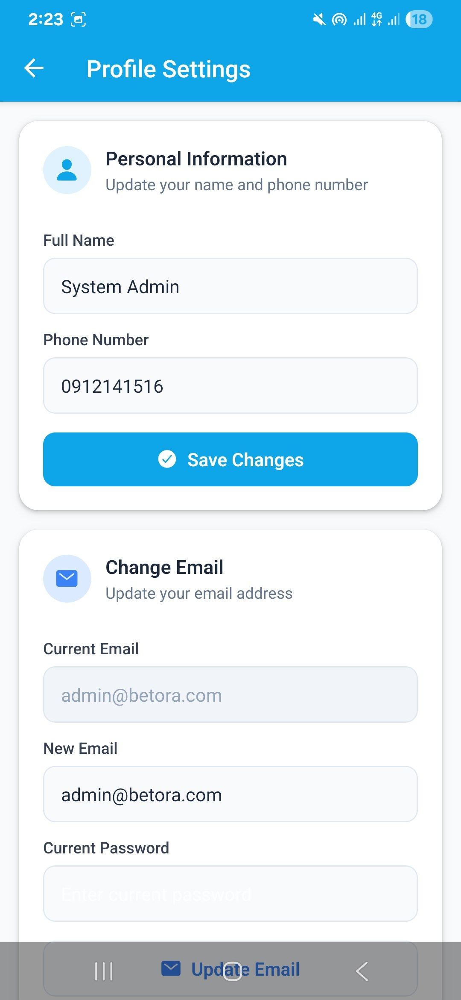   |                                                              |

## ✨ Features

### Desktop Application

- **Dashboard** - Overview with stats cards, charts, and recent activities
- **House Management** - CRUD operations for properties
- **Room Management** - Manage rooms with status tracking
- **Tenant Management** - Full tenant profiles with history
- **Rental Contracts** - Create, renew, terminate agreements
- **Payment Management** - Record payments, generate receipts, track balances
- **Expense Management** - Track property expenses by category
- **Reports** - Income, expense, occupancy reports with PDF export
- **Notifications** - Automatic reminders for payments and contracts
- **Role-based Access** - Owner, Manager, Accountant roles

### Mobile Application

- **Mobile Dashboard** - Key metrics at a glance
- **Tenant Overview** - View tenant info and payment status
- **Payment Tracking** - Filter and monitor payments
- **Reports** - Income summary and occupancy statistics
- **Push Notifications** - Real-time payment reminders via FCM

### Backend

- **RESTful API** - Full CRUD endpoints
- **JWT Authentication** - Secure token-based auth
- **Role-based Authorization** - Fine-grained access control
- **Automated Jobs** - Payment checking, overdue detection, contract expiry alerts
- **PDF Export** - Generate payment and expense reports
- **Audit Logging** - Track all system activities

## 🏗️ Tech Stack

### Desktop Application

| Technology   | Purpose                   |
| ------------ | ------------------------- |
| Electron.js  | Desktop application shell |
| React.js     | UI framework              |
| TypeScript   | Type safety               |
| Tailwind CSS | Utility-first styling     |
| Shadcn UI    | Component library         |
| Recharts     | Data visualization        |

### Mobile Application

| Technology               | Purpose                         |
| ------------------------ | ------------------------------- |
| React Native             | Cross-platform mobile framework |
| Expo                     | Development platform            |
| React Navigation         | Screen navigation               |
| Firebase Cloud Messaging | Push notifications              |
| Expo Notifications       | Local notifications             |

### Backend

| Technology | Purpose             |
| ---------- | ------------------- |
| Node.js    | Runtime environment |
| Express.js | Web framework       |
| TypeScript | Type safety         |
| Prisma ORM | Database access     |
| PostgreSQL | Relational database |
| JWT        | Authentication      |
| Winston    | Logging             |
| Node-Cron  | Scheduled jobs      |
| PDFKit     | PDF generation      |
| Zod        | Request validation  |

### Development Tools

| Tool     | Purpose          |
| -------- | ---------------- |
| Docker   | Containerization |
| ESLint   | Code linting     |
| Prettier | Code formatting  |
| Jest     | Testing          |

## 📁 Project Structure

```
BetenHomesRent/
├── desktop-app/
│   ├── frontend/          # Electron + React application
│   │   ├── src/
│   │   │   ├── components/   # Reusable UI components
│   │   │   ├── pages/        # Page components
│   │   │   ├── services/     # API client
│   │   │   ├── store/        # Auth context
│   │   │   └── routes/       # Route definitions
│   │   └── electron/         # Electron main process
│   │
│   ├── backend/            # Express API server
│   │   ├── src/
│   │   │   ├── config/       # Configuration
│   │   │   ├── controllers/  # Route handlers
│   │   │   ├── services/     # Business logic
│   │   │   ├── middleware/   # Auth, validation, error handling
│   │   │   ├── routes/       # API routes
│   │   │   ├── jobs/         # Scheduled tasks
│   │   │   └── prisma/       # Database schema & seed
│   │   └── tests/            # Test files
│   │
│   └── database/           # Database migrations & seeds
│
├── mobile-app/             # React Native application
│   └── src/
│       ├── screens/         # Screen components
│       ├── navigation/      # Navigation setup
│       ├── services/        # API client
│       ├── store/           # Auth context
│       └── notifications/   # Push notification handling
│
├── shared/                 # Shared packages
│   ├── types/              # TypeScript interfaces & enums
│   ├── constants/          # App constants
│   └── utils/              # Utility functions
│
├── deployment/             # Deployment configuration
│   ├── docker/             # Docker files
│   └── scripts/            # Deployment scripts
│
└── documentation/          # Additional documentation
```

## 🚀 Getting Started

### Prerequisites

- Node.js >= 18.0.0
- npm >= 9.0.0
- PostgreSQL >= 14
- Docker (optional)

### Installation

1. **Clone the repository**

   ```bash
   git clone https://github.com/your-org/beten-homes-rent.git
   cd beten-homes-rent
   ```

2. **Install dependencies**

   ```bash
   npm install
   ```

3. **Set up environment variables**

   ```bash
   cp desktop-app/backend/.env.example desktop-app/backend/.env
   ```

   Edit `.env` with your database credentials and JWT secrets.

4. **Start PostgreSQL with Docker (optional)**

   ```bash
   docker-compose -f deployment/docker/docker-compose.dev.yml up -d
   ```

5. **Run database migrations**

   ```bash
   npm run db:migrate
   ```

6. **Seed the database**

   ```bash
   npm run db:seed
   ```

7. **Start development servers**

   ```bash
   # Start both backend and frontend
   npm run dev

   # Or start individually:
   npm run dev:backend   # API at http://localhost:5000
   npm run dev:frontend  # App at http://localhost:5173
   ```

8. **Access the application**
   - Desktop App: `http://localhost:5173`
   - API: `http://localhost:5000/api/v1`
   - Login: `admin@betenhomesrent.com` / `admin123`

### Mobile App Setup

1. **Navigate to mobile directory**

   ```bash
   cd mobile-app
   npm install
   ```

2. **Start Expo development server**

   ```bash
   npx expo start
   ```

3. **Run on device**
   - Install Expo Go on your phone
   - Scan QR code from terminal

## 📚 API Documentation

### Authentication

| Method | Endpoint                       | Description       | Auth Required |
| ------ | ------------------------------ | ----------------- | ------------- |
| POST   | `/api/v1/auth/register`        | Register new user | No            |
| POST   | `/api/v1/auth/login`           | Login             | No            |
| POST   | `/api/v1/auth/refresh-token`   | Refresh JWT       | No            |
| GET    | `/api/v1/auth/profile`         | Get user profile  | Yes           |
| PUT    | `/api/v1/auth/profile`         | Update profile    | Yes           |
| PUT    | `/api/v1/auth/change-password` | Change password   | Yes           |

### Dashboard

| Method | Endpoint                  | Description              | Auth Required |
| ------ | ------------------------- | ------------------------ | ------------- |
| GET    | `/api/v1/dashboard/stats` | Get dashboard statistics | Yes           |

### Houses

| Method | Endpoint                   | Description       | Auth Required       |
| ------ | -------------------------- | ----------------- | ------------------- |
| GET    | `/api/v1/houses`           | List all houses   | Yes                 |
| GET    | `/api/v1/houses/search?q=` | Search houses     | Yes                 |
| GET    | `/api/v1/houses/:id`       | Get house details | Yes                 |
| POST   | `/api/v1/houses`           | Create house      | Yes (Owner/Manager) |
| PUT    | `/api/v1/houses/:id`       | Update house      | Yes (Owner/Manager) |
| DELETE | `/api/v1/houses/:id`       | Delete house      | Yes (Owner)         |

### Rooms

| Method | Endpoint               | Description       | Auth Required       |
| ------ | ---------------------- | ----------------- | ------------------- |
| GET    | `/api/v1/rooms`        | List all rooms    | Yes                 |
| GET    | `/api/v1/rooms/vacant` | List vacant rooms | Yes                 |
| GET    | `/api/v1/rooms/:id`    | Get room details  | Yes                 |
| POST   | `/api/v1/rooms`        | Create room       | Yes (Owner/Manager) |
| PUT    | `/api/v1/rooms/:id`    | Update room       | Yes (Owner/Manager) |
| DELETE | `/api/v1/rooms/:id`    | Delete room       | Yes (Owner)         |

### Tenants

| Method | Endpoint              | Description        | Auth Required       |
| ------ | --------------------- | ------------------ | ------------------- |
| GET    | `/api/v1/tenants`     | List all tenants   | Yes                 |
| GET    | `/api/v1/tenants/:id` | Get tenant details | Yes                 |
| POST   | `/api/v1/tenants`     | Create tenant      | Yes (Owner/Manager) |
| PUT    | `/api/v1/tenants/:id` | Update tenant      | Yes (Owner/Manager) |
| DELETE | `/api/v1/tenants/:id` | Delete tenant      | Yes (Owner)         |

### Contracts

| Method | Endpoint                          | Description          | Auth Required       |
| ------ | --------------------------------- | -------------------- | ------------------- |
| GET    | `/api/v1/contracts`               | List all contracts   | Yes                 |
| GET    | `/api/v1/contracts/:id`           | Get contract details | Yes                 |
| POST   | `/api/v1/contracts`               | Create contract      | Yes (Owner/Manager) |
| PUT    | `/api/v1/contracts/:id/terminate` | Terminate contract   | Yes (Owner/Manager) |
| PUT    | `/api/v1/contracts/:id/renew`     | Renew contract       | Yes (Owner/Manager) |

### Payments

| Method | Endpoint               | Description         | Auth Required                  |
| ------ | ---------------------- | ------------------- | ------------------------------ |
| GET    | `/api/v1/payments`     | List all payments   | Yes                            |
| GET    | `/api/v1/payments/:id` | Get payment details | Yes                            |
| POST   | `/api/v1/payments`     | Record payment      | Yes (Owner/Manager/Accountant) |
| PUT    | `/api/v1/payments/:id` | Update payment      | Yes (Owner/Manager/Accountant) |
| DELETE | `/api/v1/payments/:id` | Delete payment      | Yes (Owner)                    |

### Expenses

| Method | Endpoint               | Description         | Auth Required                  |
| ------ | ---------------------- | ------------------- | ------------------------------ |
| GET    | `/api/v1/expenses`     | List all expenses   | Yes                            |
| GET    | `/api/v1/expenses/:id` | Get expense details | Yes                            |
| POST   | `/api/v1/expenses`     | Record expense      | Yes (Owner/Manager/Accountant) |
| PUT    | `/api/v1/expenses/:id` | Update expense      | Yes (Owner/Manager/Accountant) |
| DELETE | `/api/v1/expenses/:id` | Delete expense      | Yes (Owner)                    |

### Notifications

| Method | Endpoint                         | Description         | Auth Required |
| ------ | -------------------------------- | ------------------- | ------------- |
| GET    | `/api/v1/notifications`          | List notifications  | Yes           |
| PUT    | `/api/v1/notifications/:id/read` | Mark as read        | Yes           |
| PUT    | `/api/v1/notifications/read-all` | Mark all as read    | Yes           |
| DELETE | `/api/v1/notifications/:id`      | Delete notification | Yes           |

### Reports

| Method | Endpoint                          | Description         | Auth Required |
| ------ | --------------------------------- | ------------------- | ------------- |
| GET    | `/api/v1/reports/income`          | Income report       | Yes           |
| GET    | `/api/v1/reports/expenses`        | Expense report      | Yes           |
| GET    | `/api/v1/reports/occupancy`       | Occupancy report    | Yes           |
| GET    | `/api/v1/reports/export/payments` | Export payments PDF | Yes           |
| GET    | `/api/v1/reports/export/expenses` | Export expenses PDF | Yes           |

## 🗄️ Database Schema

### Entity Relationship Diagram

```
User (1) ──── (N) House
House (1) ──── (N) Room
Room (1) ──── (N) Tenant
Tenant (1) ──── (N) RentalContract
RentalContract (1) ──── (N) Payment
Room (1) ──── (N) Payment
House (1) ──── (N) Expense
User (1) ──── (N) Expense
User (1) ──── (N) Notification
User (1) ──── (N) AuditLog
```

### Tables

- **User** - System users with role-based access (Owner, Manager, Accountant)
- **House** - Property/ building information
- **Room** - Individual rental units within houses
- **Tenant** - Tenant personal information and contact details
- **RentalContract** - Rental agreements linking tenants to rooms
- **Payment** - Rent payments with status tracking
- **Expense** - Property expenses by category
- **Notification** - System notifications and reminders
- **AuditLog** - Audit trail for all system actions

## 🐳 Docker Deployment

### Production Deployment

```bash
# Build and start all services
docker-compose -f docker-compose.yml up -d

# Run migrations
docker-compose exec backend npx prisma migrate deploy

# Seed database
docker-compose exec backend npx prisma db seed

# View logs
docker-compose logs -f
```

### Development Database

```bash
# Start only PostgreSQL
docker-compose -f deployment/docker/docker-compose.dev.yml up -d
```

## 🔒 Security

- JWT-based authentication with token refresh
- Role-based authorization (Owner, Manager, Accountant)
- Password hashing with bcrypt (12 rounds)
- Input validation with Zod
- HTTP security headers with Helmet
- Rate limiting on API endpoints
- CORS configuration
- Environment variable management
- Audit logging for sensitive operations

## 🧪 Testing

```bash
# Run all tests
npm test

# Run backend tests
npm run test --workspace=@beten-homes-rent/backend
```

## 📱 Mobile App Features

### Push Notifications

The mobile app automatically receives notifications for:

- **Payment Due Today** - When rent payment is due
- **Payment Overdue** - When payment becomes overdue
- **Contract Expiring** - 7 days before contract expiration

### Offline Capabilities

- Secure token storage with AsyncStorage
- Data persistence across app restarts

## 🤝 Contributing

1. Fork the repository
2. Create a feature branch (`git checkout -b feature/amazing-feature`)
3. Commit changes (`git commit -m 'Add amazing feature'`)
4. Push to branch (`git push origin feature/amazing-feature`)
5. Open a Pull Request

### Development Guidelines

- Follow TypeScript strict mode
- Write tests for new features
- Update API documentation
- Use conventional commits
- Run linting before committing

## 📄 License

This project is proprietary software. All rights reserved.

## 👥 Authors

- Beten Homes Rent Development Team

## 🙏 Acknowledgments

- Shadcn UI for component library
- Tailwind CSS for styling utilities
- Prisma for database tooling
- Expo for mobile development

---

**Built with ❤️ for property managers and landlords**
